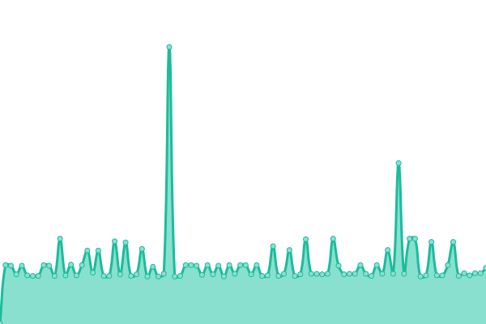

# [📈 Live Status](https://status.th7bo.com): <!--live status--> **🟧 Partial outage**

This repository contains the open-source uptime monitor and status page for [Th7bo](https://status.th7bo.com), powered by [Upptime](https://github.com/upptime/upptime).

With [Upptime](https://upptime.js.org), you can get your own unlimited and free uptime monitor and status page, powered entirely by a GitHub repository. We use [Issues](https://github.com/Th7bo/Depthful_Uptime/issues) as incident reports, [Actions](https://github.com/Th7bo/Depthful_Uptime/actions) as uptime monitors, and [Pages](https://status.th7bo.com) for the status page.

<!--start: status pages-->
<!-- This summary is generated by Upptime (https://github.com/upptime/upptime) -->
<!-- Do not edit this manually, your changes will be overwritten -->
<!-- prettier-ignore -->
| URL | Status | History | Response Time | Uptime |
| --- | ------ | ------- | ------------- | ------ |
|  [th7bo.com](https://www.th7bo.com) | 🟩 Up | [th7bo-com.yml](https://github.com/Th7bo/Depthful_Uptime/commits/HEAD/history/th7bo-com.yml) | 

 178ms
     
 | 

<a href="https://status.th7bo.com/history/th7bo-com">100.00%</a>
    

|  [panel.th7bo.com](https://panel.th7bo.com) | 🟩 Up | [panel-th7bo-com.yml](https://github.com/Th7bo/Depthful_Uptime/commits/HEAD/history/panel-th7bo-com.yml) | 

 227ms
     
 | 

<a href="https://status.th7bo.com/history/panel-th7bo-com">100.00%</a>
    

|  [node3.th7bo.com](node3.th7bo.com) | 🟥 Down | [node3-th7bo-com.yml](https://github.com/Th7bo/Depthful_Uptime/commits/HEAD/history/node3-th7bo-com.yml) | 

 111ms
     
 | 

<a href="https://status.th7bo.com/history/node3-th7bo-com">10.24%</a>
    

|  [Depthful server](https://api.mcsrvstat.us/3/play.th7bo.com) | 🟩 Up | [depthful-server.yml](https://github.com/Th7bo/Depthful_Uptime/commits/HEAD/history/depthful-server.yml) | 

 1356ms
     
 | 

<a href="https://status.th7bo.com/history/depthful-server">99.90%</a>
    

<!--end: status pages-->

[**Visit our status website →**](https://status.th7bo.com)

## 📄 License

- Powered by: [Upptime](https://github.com/upptime/upptime)
- Code: [MIT](./LICENSE) © [Anand Chowdhary](https://anandchowdhary.com), supported by [Pabio](https://pabio.com)
- Data in the `./history` directory: [Open Database License](https://opendatacommons.org/licenses/odbl/1-0/)
